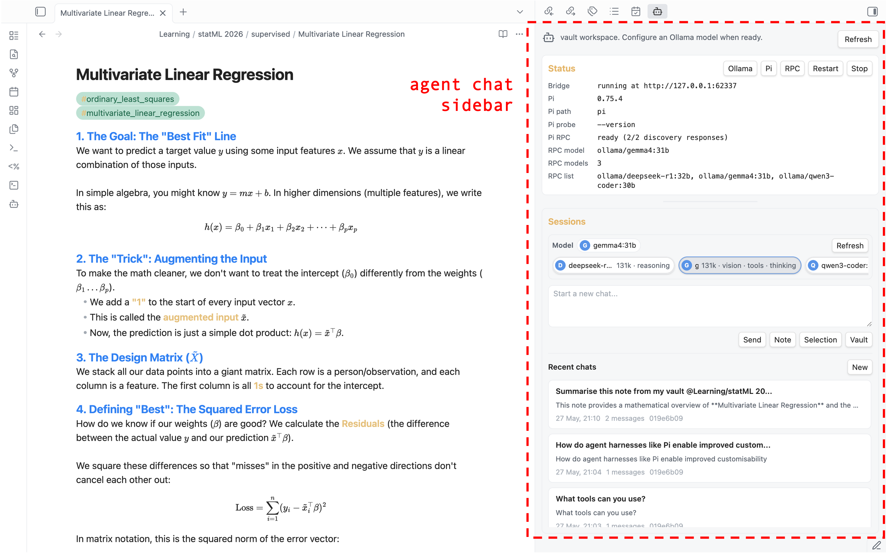
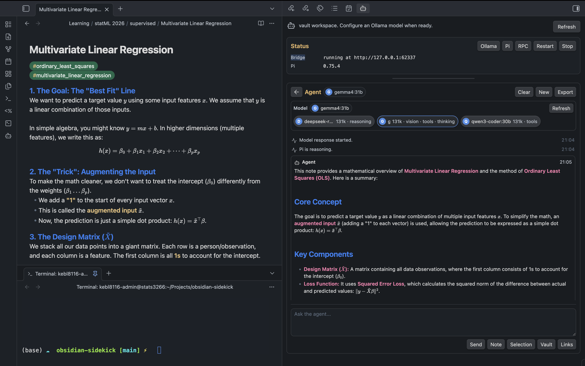

# Local Sidekick

A light Obsidian plugin I got Codex to build for me so I could use local LLM agents through a simple interactive chat sidebar in Obsidian via Ollama and the Pi agent harness. 

DISCLAIMER: I am not a javascript/node developer. This is a vibe-coded project with human oversight prioritising safe, conservative agent capabilities and simplicity. If anyone has relevant experience or suggestions for improvements, I'd be happy to hear from you. I know that one or two similar agent plugins exist, but I wanted one specifically designed for local agents as a lightweight sidebar chat rather than a full dashboard or ACP generalist.

## About
Local Sidekick is a privacy-first local LLM sidebar for Obsidian, designed for Pi and Ollama users who want vault-aware chat, explicit note context, conservative reviewed edits, with explicit safety boundaries and local-only workflows.


Local Sidekick seamlessly uses your Obsidian theme for its UI, supporting dark and light mode. It can be launched from the command palette or from the small AI agent icon on the left toolbar. Doing so will open the interactive dashboard as a tab in the right hand sidebar. An agent status panel at the top of the sidebar gives real time information on the local models being used alongside interactive buttons to find local models. Below a new chat can be started from an interactive prompt box with model selection or a recent chat from session history continued.

## Features
- Local model workflow through Pi and Ollama.
- Vault-native Sidekick agent profiles, prompt library files, and memory files under `Sidekick/`.
- Persistent chat sessions with a history landing page.
- Compact model rail with discovered Pi/Ollama models and capability badges.
- Markdown and math rendering through Obsidian's renderer.
- Vault file mentions with `@`, including Markdown, text-like files, attachments, and best-effort PDF text extraction.
- Prompt context helpers:
  - `@search(query)` for local vault search.
  - `@semantic(query)` for lightweight related-note search.
  - `@vault-index` for filenames and top headings.
  - `@links` or `@links(query)` for conservative internal link suggestions.
  - `@cmd(command)` for exact allowlisted local commands.
  - `@url(url)` for optional HTTPS web fetch context from explicitly allowlisted hosts.
- Reviewed Markdown edit proposals with visible diffs and approval before write.
- Chat export to Markdown, defaulting to a `Chats/` folder in the vault.
- Starter research tutor, writing editor, code reviewer, vault linker, and glossary curator profiles.
- Explicit export of Sidekick profiles into Pi prompt templates and skills under `.pi/`.
- Obsidian command palette actions for opening the sidebar, exporting chats, checking Pi/Ollama, refreshing Sidekick memory files, and suggesting internal links.


Chat session agent reply streams are rendered in markdown with your Obsidian theme, handling math and standard formatting. For a full Obsidian IDE experience use the terminal plugin alongside this so you never have to leave Obsidian!

### Internal Link Suggestions
Sidekick also includes a plugin-native internal link suggester, available from the command palette or with @links, that proposes connections between notes without requiring Pi tool support. It builds conservative candidates from Markdown filenames and top-level headings, ranks them with local related-note search, and shows reviewed diffs before any note is changed.

### New Agentic Productivity Features Introduced in v0.1.8
To better exploit the local-first nature of Sidekick, v0.1.8 introduces a set of features for turning your vault into a persistent source of agent instructions, memory, and workflow configuration.
- Sidekick can now create a `Sidekick/` folder in the root of your vault, including template `.agent.md` profiles for different use cases.
- `.agent.md` profiles can specify preferred local models, tool usage preferences, included memory files, and system-style instructions written directly in Markdown.
- Agent profiles can be selected from the UI, with model choices narrowed to the models that make sense for that profile.
- Custom prompts, vault memory, project summaries, glossaries, and other reusable context can now live as ordinary Markdown files inside the vault and be referenced with `@`.
- Users can ask the agent to help generate or update profile files and memory files, making it easier to maintain things like a vault glossary or project index over time.
- Sidekick can export selected profiles, prompts, and skills in a Pi-compatible format for use outside the plugin.

## Requirements
- Obsidian desktop `1.5.0` or newer.
- Node.js and npm for building from source.
- Ollama running locally.
- Pi installed and available as `pi`, or configured with an absolute executable path in plugin settings.
- At least one Ollama model configured in Pi.

Tool use depends on the selected model. Some Ollama models can chat but do not support tools. When a model does not support tools, keep Pi tools disabled and use explicit `@` context, `@search`, `@semantic`, and `@vault-index` instead.

## Installation
Local Sidekick is alpha software and is not yet listed in the Obsidian Community Plugins store, so it can't be found by searching inside Obsidian. For now, install it via [BRAT](https://github.com/TfTHacker/obsidian42-brat) (point it at this repository to install and auto-update from GitHub releases), or build from source (below). A Community Plugins submission is planned once it leaves alpha.

### From Source
1. Clone this repository.
2. Install dependencies:

```bash
npm install
```

3. Build the plugin:

```bash
npm run build
```

4. Create this folder in your vault:

```text
.obsidian/plugins/local-sidekick/
```

5. Copy these files into that folder:

```text
main.js
manifest.json
styles.css
```

6. Reload Obsidian and enable `Local Sidekick` in `Settings -> Community plugins`.

For alpha testing, use a copied vault or a small test vault first.

## Pi And Ollama Setup
1. Start Ollama.
2. Pull the local models you want to use.
3. Configure Pi so it can see those models.
4. In Obsidian, open `Settings -> Local Sidekick`.
5. Confirm:
   - `Ollama host` points to your local Ollama server, usually `http://127.0.0.1:11434`.
   - `Pi executable` is either `pi` or the absolute path to your Pi binary.
   - `Pi tools` is `Disabled` until you intentionally enable read-only tools.
6. Open the sidebar and click `Ollama`, `Pi`, and `RPC` to confirm discovery.

The sidebar can still be useful without Pi tools. File mentions and local context directives are often safer and more reliable than asking a model to inspect the vault on its own.

## Usage
Open the command palette and run `Open sidekick`. Local Sidekick opens as a right sidebar so your main note stays visible.

Start a new chat from the session landing page, or select a previous session. Use the agent profile selector to choose a local `.agent.md` profile, then use the model rail at the top to switch among that profile's model choices. Use `@` in the composer to attach vault files as context.

Useful prompt patterns:

```text
Summarize @Projects/Example/MAIN.md and list only facts supported by that file.
```

```text
Use @vault-index and @semantic(EGNO interpolation) to suggest related notes.
```

```text
Use @links for this note and propose only high-confidence Obsidian links.
```

```text
Use @cmd(git status) and tell me whether the vault plugin repo is clean.
```

```text
/agent research-tutor
Explain @Projects/Example/MAIN.md and quiz me on the key definitions.
```

When the agent proposes edits, it must use reviewed edit blocks. The plugin renders a diff and requires approval before applying changes.

## Sidekick Agent Profiles And Memory
Local Sidekick can create a vault-root `Sidekick/` folder for portable agent profiles and durable local memory files:

```text
Sidekick/
  Agents/
    research-tutor.agent.md
    writing-editor.agent.md
    code-reviewer.agent.md
    vault-linker.agent.md
    glossary-curator.agent.md
  Prompts/
    summarize-note.prompt.md
    research-questions.prompt.md
    glossary-update.prompt.md
  Memory/
    vault-summary.md
    user-preferences.md
    project-index.md
    glossary.md
```

Create these starter files from Settings, the sidebar `Create` button, or the `Create Sidekick starter files` command. `Sidekick/Prompts/*.prompt.md` files are ordinary Markdown prompt snippets: mention them with `@`, copy from them, or include them from an `.agent.md` profile. Refresh `Sidekick/Memory/project-index.md` with the `Refresh Sidekick project index` command; it is generated from local Markdown filenames and top headings.

A `.agent.md` file uses simple YAML frontmatter plus Markdown instructions:

```markdown
---
name: research-tutor
description: Socratic research helper for careful note-grounded explanations.
models:
  - ollama/qwen3-coder:30b
  - ollama/deepseek-r1:32b
tools: disabled
include:
  - Sidekick/Memory/vault-summary.md
  - Sidekick/Memory/user-preferences.md
  - Sidekick/Memory/glossary.md
---

You are a careful research tutor working inside an Obsidian vault.
Use only supplied vault context as evidence for claims about the user's notes.
```

The Markdown body is added to the prompt as system-style guidance. `include` files are read through the Obsidian vault API and added as explicit context. `models` filters the model rail to the profile's preferred choices while still letting the user pick among those local models. `tools` currently supports only `disabled` and `read-only`; broader Pi tools are still not exposed by Local Sidekick.

You can also select a profile inline by making `/agent profile-name` the first line of a prompt. Use `/agent clear` as the first line to clear the current profile.

The `vault-linker` and `glossary-curator` starters formalize the existing internal-link and glossary workflows: they use the generated project index, related-note search, and reviewed edit proposals so link/glossary changes stay conservative and inspectable.

Use `Export Sidekick Pi resources` when you want matching Pi resources outside the Local Sidekick prompt path. This creates or updates `.pi/prompts/*.md`, `.pi/skills/sidekick-vault-linker/SKILL.md`, `.pi/skills/sidekick-glossary-curator/SKILL.md`, and merges `prompts`/`skills` entries into `.pi/settings.json`. This is explicit because `.pi/settings.json` can affect Pi runs started directly from the vault root.

## Safety
Local Sidekick is built around conservative defaults.

- The default Pi tool mode is disabled.
- `.agent.md` files and Sidekick memory files are local vault files that can steer prompt instructions, model choices, and disabled/read-only Pi tool mode. Inspect them before using profiles from an untrusted vault.
- `Export Sidekick Pi resources` writes `.pi/` project resources only after you invoke it. Inspect generated `.pi/settings.json` if you also run Pi directly in the vault.
- Read-only Pi tools, when enabled, are limited to `read`, `grep`, `find`, and `ls`.
- Pi `bash`, edit, and write tools are not enabled by the plugin.
- The plugin launches the local Pi executable to run the agent. This is necessary for local agent workflows and is why automated review tools may report shell/process execution.
- Pi is launched without a shell. The executable is `pi` by default, and non-default executable paths require per-session confirmation.
- Shell execution is not generally available to the model or chat.
- `@cmd(...)` only runs exact commands listed in the safe command allowlist, which you can edit in settings.
- The default safe command allowlist is intentionally narrow: `git status` and `git diff --stat`.
- Safe commands run without a shell and from the vault root. Avoid adding package-manager scripts unless you trust the vault/repo.
- File writes require reviewed Markdown edit proposals and user approval.
- Deletes are blocked.
- Writes outside the vault are blocked.
- URL fetching is disabled by default.
- `@url(...)` requires HTTPS, requires an explicit host allowlist, and blocks localhost/private/link-local/reserved/metadata IP ranges after DNS resolution.
- External workspace roots are opt-in and read-only.

These guardrails reduce risk, but they do not make local agent workflows risk-free. Local models can hallucinate, misunderstand paths, or propose incorrect edits. Review diffs before approving them.

## Local Data And Sync
Local Sidekick stores settings, chat history, proposed edits, approvals, and session metadata in the plugin's Obsidian data file inside the vault configuration. That data is local to your vault, but it may be copied by Obsidian Sync, iCloud, Dropbox, Git, or any other sync/backup tool that includes your `.obsidian` folder.

Treat `.obsidian/plugins/local-sidekick/data.json` as private vault data. It may contain prompts, model replies, note excerpts, proposed file contents, and local settings. Do not publish or share it accidentally.

Persistent Pi session files are stored under the plugin folder in your vault configuration. Local Sidekick prepares that folder through Obsidian's vault adapter before launching Pi.

Because vault plugin data can be imported from someone else, Local Sidekick asks for per-session confirmation before using a non-default Pi executable path or before launching Pi with experimental extensions, skills, prompt templates, and context files enabled. Keep `Pi executable` set to `pi` and experimental Pi features disabled unless you intentionally trust the configured behavior.

## Experimental Pi Features
By default, Local Sidekick starts Pi with extensions, skills, prompt templates, and context files disabled for prompt runs. This keeps the plugin's behavior narrow and makes vault context explicit.

Advanced users can enable `Allow Pi extensions, skills, prompt templates, and context files` under the `Experimental` settings section. When enabled, Local Sidekick stops passing the Pi flags that disable those features, so Pi may load whatever your Pi configuration, extensions, skills, prompt templates, or context files define. This path is not the default because it has not been fully tested with Local Sidekick's safety model and may add extra tools or context outside the plugin's own UI.

Pi tools are separate. They remain disabled by default. The only supported Pi tool mode in the plugin UI is the read-only tool allowlist: `read`, `grep`, `find`, and `ls`. Broader Pi tool use is intentionally not exposed yet.

## PDF Support
PDF mention support is best-effort. The plugin tries to extract text from common text-based PDFs inside the vault and adds that text as prompt context.

Limitations:

- No OCR.
- Scanned PDFs may produce no text.
- Encrypted or unusual PDFs may fail extraction.
- Very large PDFs are skipped.
- Compressed and decompressed PDF streams have stricter per-stream and total limits to reduce UI freezes from malicious or unusual PDFs.
- Extracted text is capped before it is sent to the model.

When PDF extraction fails, the plugin should tell the model that content was unavailable rather than letting it infer details from the filename.

## Internal Link Suggestions
Sidekick includes a plugin-native internal link suggester, available from the command palette or with `@links`, that proposes connections between notes without requiring Pi tool support. It builds conservative candidates from Markdown filenames and top-level headings, ranks them with local related-note search, and shows reviewed diffs before any note is changed.

## Troubleshooting
### "Offline error" when starting Pi or RPC
Pi runs a version check against the network at startup, and the result is cached for a few days. On an offline machine that cache eventually expires, and the next launch fails with an offline error even though your models are local. Local Sidekick launches Pi with `PI_SKIP_VERSION_CHECK=1` so this check never runs and the plugin stays fully local. If you still see network errors on launch, confirm you are on a build from v0.1.11 or later.

For fully offline use, keep an `ollama/` model selected in the model rail. A cloud-provider model such as `anthropic/...` still needs network access for inference; only `ollama/` models run entirely against your local Ollama host.

## Known Limitations
- This is alpha software.
- Local models may hallucinate unless given exact context.
- Some Ollama models do not support tools.
- Pi behavior depends on the installed Pi version and local configuration.
- PDF extraction is not a full PDF parser and does not perform OCR.
- Web fetch is intentionally limited, disabled by default, HTTPS-only, and requires an explicit host allowlist.
- The reviewed edit path currently targets Markdown files.
- There is no automated end-to-end test suite yet.
- Not yet listed in the Obsidian Community Plugins store; install from source or via BRAT until a submission is accepted.

## Commands
The plugin registers these Obsidian commands:

- `Open sidekick`
- `Insert sidekick block`
- `Refresh Sidekick agent profiles`
- `Create Sidekick starter files`
- `Refresh Sidekick project index`
- `Export Sidekick Pi resources`
- `Restart sidekick bridge`
- `Stop sidekick bridge`
- `Check Ollama status`
- `Check Pi executable`
- `Discover Pi RPC`
- `Stop agent run`
- `Clear agent events`
- `Start new persistent agent session`
- `Export active agent chat to Markdown`
- `Suggest internal links for current note`
- `Run agent safety self-check`
- `Create sample approval request`

