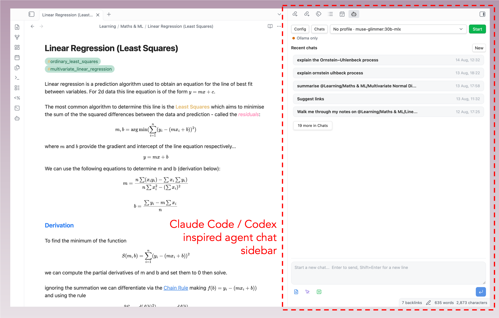
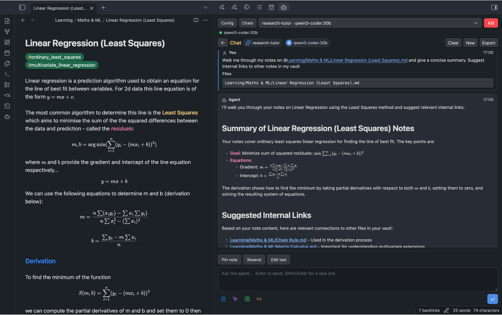

# Local Sidekick

A light Obsidian plugin I got Codex to build for me so I could use local LLM agents through a simple interactive chat sidebar in Obsidian via Ollama and the Pi agent harness. 

DISCLAIMER: I am not a javascript/node developer. This is a vibe-coded project with human oversight prioritising safe, conservative agent capabilities and simplicity. If anyone has relevant experience or suggestions for improvements, I'd be happy to hear from you. I know that one or two similar agent plugins exist, but I wanted one specifically designed for local agents as a lightweight sidebar chat rather than a full dashboard or ACP generalist.

## About
Local Sidekick is a local-first LLM sidebar for Obsidian, for Pi and Ollama users who want vault-aware chat without anything leaving their machine.

## What It Does To Your Vault
Read this before installing.

**Local Sidekick reads your vault. That is the point of it.** By default it launches Pi with its read-only tools enabled — `read`, `grep`, `find`, and `ls` — rooted at your vault. The agent can open and search your notes on its own, without asking each time. The plugin also assembles context itself from `@`-mentions, the current note or selection, vault search, and pinned notes.

What it will not do by default:

- **Write.** Every change arrives as a proposal. You see a diff and approve each one individually, and only Markdown files inside the vault can be written.
- **Delete.** Not implemented at all.
- **Run shell commands.** Only exact entries in a allowlist you maintain, only when you type `@cmd(...)` yourself, and never through a shell.
- **Reach the network.** Web fetch is off. Enabled, it is HTTPS-only to hosts you list explicitly.
- **Phone home.** No telemetry. Prompts go to your local Ollama and nowhere else.

**One setting removes those limits: `Allow Pi extensions and user configuration`.** It is off by default. Turning it on lets Pi load your own extensions, skills, prompt templates, and context files. Pi's tool restrictions only cover its *built-in* tools, so an extension can register tools that ignore everything above and execute whatever they like on your machine. That is a legitimate thing to want, and it is your call — but from that point the plugin can no longer bound what Pi does, and the responsibility for what your extensions run is yours.


Local Sidekick seamlessly uses your Obsidian theme for its UI, supporting dark and light mode. It can be launched from the command palette or from the small AI agent icon on the left toolbar. Doing so will open the interactive dashboard as a tab in the right hand sidebar. An agent status panel at the top of the sidebar gives real time information on the local models being used alongside interactive buttons to find local models. Below a new chat can be started from an interactive prompt box with model selection or a recent chat from session history continued.

## Features
- Local model workflow through Pi and Ollama.
- Vault-native Sidekick agent profiles, prompt library files, and memory files under `Sidekick/`.
- Persistent chat sessions with a history landing page.
- Compact model rail with discovered Pi/Ollama models and capability badges.
- Markdown and math rendering through Obsidian's renderer.
- Vault file mentions with `@`, including Markdown, text-like files, attachments, and best-effort PDF text extraction.
- Prompt context helpers:
  - `@search(query)` for local vault search.
  - `@semantic(query)` for lightweight related-note search.
  - `@vault-index` for filenames and top headings.
  - `@links` or `@links(query)` for conservative internal link suggestions.
  - `@cmd(command)` for exact allowlisted local commands.
  - `@url(url)` for optional HTTPS web fetch context from explicitly allowlisted hosts.
- Reviewed Markdown edit proposals with visible diffs and approval before write.
- Chat export to Markdown, defaulting to a `Chats/` folder in the vault.
- Starter research tutor, writing editor, code reviewer, vault linker, and glossary curator profiles.
- Explicit export of Sidekick profiles into Pi prompt templates and skills under `.pi/`.
- Obsidian command palette actions for opening the sidebar, exporting chats, checking Pi/Ollama, refreshing Sidekick memory files, and suggesting internal links.


Chat session agent reply streams are rendered in markdown with your Obsidian theme, handling math and standard formatting. For a full Obsidian IDE experience use the terminal plugin alongside this so you never have to leave Obsidian!

### Internal Link Suggestions
Sidekick also includes a plugin-native internal link suggester, available from the command palette or with @links, that proposes connections between notes without requiring Pi tool support. It builds conservative candidates from Markdown filenames and top-level headings, ranks them with local related-note search, and shows reviewed diffs before any note is changed.

### New Agentic Productivity Features Introduced in v0.1.8
To better exploit the local-first nature of Sidekick, v0.1.8 introduces a set of features for turning your vault into a persistent source of agent instructions, memory, and workflow configuration.
- Sidekick can now create a `Sidekick/` folder in the root of your vault, including template `.agent.md` profiles for different use cases.
- `.agent.md` profiles can specify preferred local models, tool usage preferences, included memory files, and system-style instructions written directly in Markdown.
- Agent profiles can be selected from the UI, with model choices narrowed to the models that make sense for that profile.
- Custom prompts, vault memory, project summaries, glossaries, and other reusable context can now live as ordinary Markdown files inside the vault and be referenced with `@`.
- Users can ask the agent to help generate or update profile files and memory files, making it easier to maintain things like a vault glossary or project index over time.
- Sidekick can export selected profiles, prompts, and skills in a Pi-compatible format for use outside the plugin.

## Requirements
- Obsidian desktop `1.5.0` or newer.
- Node.js and npm for building from source.
- Ollama running locally.
- Pi installed and available as `pi`, or configured with an absolute executable path in plugin settings.
- At least one Ollama model configured in Pi.

Tool use depends on the selected model. Some Ollama models can chat but do not support tools. When a model does not support tools, set `Pi tools` to `Disabled` and use explicit `@` context, `@search`, `@semantic`, and `@vault-index` instead.

## Installation
Install from inside Obsidian: open Settings → Community plugins, browse, search for "Local Sidekick", install, and enable it. You can also build from source (below).

### From Source
1. Clone this repository.
2. Install dependencies:

```bash
npm install
```

3. Build the plugin:

```bash
npm run build
```

4. Create this folder in your vault:

```text
.obsidian/plugins/local-sidekick/
```

5. Copy these files into that folder:

```text
main.js
manifest.json
styles.css
```

6. Reload Obsidian and enable `Local Sidekick` in `Settings -> Community plugins`.

For alpha testing, use a copied vault or a small test vault first.

## Pi And Ollama Setup
1. Start Ollama.
2. Pull the local models you want to use.
3. Tell Pi about those models. **This step is required and is not automatic** — Pi does not read Ollama's inventory. List each model in `~/.pi/agent/models.json`:

```json
{
  "providers": {
    "ollama": {
      "api": "openai-completions",
      "apiKey": "ollama",
      "baseUrl": "http://127.0.0.1:11434/v1",
      "models": [
        { "id": "gemma4:31b" },
        { "id": "qwen3-coder:30b" }
      ]
    }
  }
}
```

   `apiKey` must be present even though Ollama ignores it. A model you have pulled but not listed here appears in the model picker marked `not in Pi`; click it to copy the entry to paste into this file.
4. In Obsidian, open `Settings -> Local Sidekick`.
5. Confirm:
   - `Ollama host` points to your local Ollama server, usually `http://127.0.0.1:11434`.
   - `Pi executable` is either `pi` or the absolute path to your Pi binary.
   - `Pi tools` is `Read-only` (the default) or `Disabled` if you want Pi fully tool-free.
   - `Allow Pi extensions and user configuration` is off, unless you trust every extension your Pi setup loads.
6. Open the sidebar and click `Ollama`, `Pi`, and `RPC` to confirm discovery.

The sidebar can still be useful without Pi tools. File mentions and local context directives are often safer and more reliable than asking a model to inspect the vault on its own.

## Usage
Open the command palette and run `Open sidekick`. Local Sidekick opens as a right sidebar so your main note stays visible.

Start a new chat from the session landing page, or select a previous session. Use the agent profile selector to choose a local `.agent.md` profile, then use the model rail at the top to switch among that profile's model choices. Use `@` in the composer to attach vault files as context.

Useful prompt patterns:

```text
Summarize @Projects/Example/MAIN.md and list only facts supported by that file.
```

```text
Use @vault-index and @semantic(EGNO interpolation) to suggest related notes.
```

```text
Use @links for this note and propose only high-confidence Obsidian links.
```

```text
Use @cmd(git status) and tell me whether the vault plugin repo is clean.
```

```text
/agent research-tutor
Explain @Projects/Example/MAIN.md and quiz me on the key definitions.
```

When the agent proposes edits, it must use reviewed edit blocks. The plugin renders a diff and requires approval before applying changes.

## Sidekick Agent Profiles And Memory
**Nothing is written to your vault on install.** The starter profiles are created only when you ask for them, from `Settings -> Local Sidekick -> Create starters`, the sidebar `Create` button, or the `Create Sidekick starter files` command. Until then no `Sidekick/` folder exists and the profile picker is empty, which is expected.

When you do, Local Sidekick creates a vault-root `Sidekick/` folder for portable agent profiles and durable local memory files:

```text
Sidekick/
  Agents/
    research-tutor.agent.md
    writing-editor.agent.md
    code-reviewer.agent.md
    vault-linker.agent.md
    glossary-curator.agent.md
  Prompts/
    summarize-note.prompt.md
    research-questions.prompt.md
    glossary-update.prompt.md
  Memory/
    vault-summary.md
    user-preferences.md
    project-index.md
    glossary.md
```

Create these starter files from Settings, the sidebar `Create` button, or the `Create Sidekick starter files` command. `Sidekick/Prompts/*.prompt.md` files are ordinary Markdown prompt snippets: mention them with `@`, copy from them, or include them from an `.agent.md` profile. Refresh `Sidekick/Memory/project-index.md` with the `Refresh Sidekick project index` command; it is generated from local Markdown filenames and top headings.

A `.agent.md` file uses simple YAML frontmatter plus Markdown instructions:

```markdown
---
name: research-tutor
description: Socratic research helper for careful note-grounded explanations.
models:
  - ollama/qwen3-coder:30b
  - ollama/deepseek-r1:32b
tools: disabled
include:
  - Sidekick/Memory/vault-summary.md
  - Sidekick/Memory/user-preferences.md
  - Sidekick/Memory/glossary.md
---

You are a careful research tutor working inside an Obsidian vault.
Use only supplied vault context as evidence for claims about the user's notes.
```

The Markdown body is added to the prompt as system-style guidance. `include` files are read through the Obsidian vault API and added as explicit context. `models` filters the model rail to the profile's preferred choices while still letting the user pick among those local models. `tools` currently supports only `disabled` and `read-only`; broader Pi tools are still not exposed by Local Sidekick.

You can also select a profile inline by making `/agent profile-name` the first line of a prompt. Use `/agent clear` as the first line to clear the current profile.

The `vault-linker` and `glossary-curator` starters formalize the existing internal-link and glossary workflows: they use the generated project index, related-note search, and reviewed edit proposals so link/glossary changes stay conservative and inspectable.

Use `Export Sidekick Pi resources` when you want matching Pi resources outside the Local Sidekick prompt path. This creates or updates `.pi/prompts/*.md`, `.pi/skills/sidekick-vault-linker/SKILL.md`, `.pi/skills/sidekick-glossary-curator/SKILL.md`, and merges `prompts`/`skills` entries into `.pi/settings.json`. This is explicit because `.pi/settings.json` can affect Pi runs started directly from the vault root.

## Safety
Local Sidekick reads your vault by default and writes to it only with your approval. The list below is what that means precisely.

**Reading — on by default**

- Pi runs with its read-only tools: `read`, `grep`, `find`, and `ls`, rooted at your vault. The agent decides when to use them; it does not ask per file.
- The plugin separately reads notes you attach with `@`, Note/Selection/Vault context, pinned notes, and Sidekick profile and memory files.
- `.agent.md` profiles and memory files are ordinary vault files that steer prompt instructions, model choice, and tool mode. Inspect them before using profiles from a vault you did not create.
- External workspace roots are opt-in and read-only.

**Writing — requires your approval every time**

- Changes arrive as reviewed Markdown edit proposals. You see a diff and approve each one.
- Markdown only, inside the vault only. Writes outside the vault are blocked.
- Deletes are not implemented.
- `Export Sidekick Pi resources` writes `.pi/` resources only when you invoke it. Inspect the generated `.pi/settings.json` if you also run Pi directly in the vault.

**Executing — narrow and explicit**

- Pi `bash`, edit, and write tools are not requested by the plugin.
- The plugin launches the local `pi` executable to run the agent. That is inherent to local agent workflows, and is why automated scanners report process execution.
- Pi and safe commands are launched without a shell, so pipes, redirects, and chaining are unavailable through these paths.
- `@cmd(...)` runs only exact entries from your safe command allowlist, and only when you type it. The default list is `git status` and `git diff --stat`. Commands run from the vault root — avoid adding package-manager scripts unless you trust the repo.
- Non-default Pi executable paths require per-session confirmation, because vault settings can come from elsewhere.

**Network — off by default**

- Web fetch is disabled. Enabled, `@url(...)` requires HTTPS and an explicit host allowlist, and blocks localhost, private, link-local, reserved, and metadata IP ranges after DNS resolution.
- No telemetry. Prompts go to your local Ollama and nowhere else.

**The one setting that removes all of this**

`Allow Pi extensions and user configuration` is off by default. Enabling it lets Pi load your extensions, skills, prompt templates, and context files. Because Pi's tool limits cover only its built-in tools, an extension can register tools that ignore every boundary above and run arbitrary code on your machine. Local Sidekick does not inspect or sandbox them and cannot warn you about what they do. Enable it if you want your own Pi extensions — that is a reasonable thing to want — and understand that from then on the guarantees are yours to maintain, not the plugin's.

None of this makes local agent workflows risk-free. Local models hallucinate, misread paths, and propose wrong edits. Read the diffs before approving them.

## Local Data And Sync
Local Sidekick stores settings, chat history, proposed edits, approvals, and session metadata in the plugin's Obsidian data file inside the vault configuration. That data is local to your vault, but it may be copied by Obsidian Sync, iCloud, Dropbox, Git, or any other sync/backup tool that includes your `.obsidian` folder.

Treat `.obsidian/plugins/local-sidekick/data.json` as private vault data. It may contain prompts, model replies, note excerpts, proposed file contents, and local settings. Do not publish or share it accidentally.

Persistent Pi session files are stored under the plugin folder in your vault configuration. Local Sidekick prepares that folder through Obsidian's vault adapter before launching Pi.

Because vault plugin data can be imported from someone else, Local Sidekick asks for per-session confirmation before using a non-default Pi executable path. Keep `Pi executable` set to `pi` unless you intentionally trust the configured behavior.

## What Enforces Tool Limits
Local Sidekick limits Pi by passing `--tools read,grep,find,ls` (the default) or `--no-tools` when it launches Pi. **Pi enforces that, not this plugin.** There is no interception point, so if the sidebar shows `Ran outside allowlist: ...`, Pi has already executed that tool and the entry is a report rather than a prevention.

Pi's read-only tools run with the working directory set to your vault, but the plugin does not confine Pi to the vault.

## Pi Extensions And User Configuration
By default Local Sidekick disables Pi extensions, skills, prompt templates, and context files. This is a security control, not a convenience default.

Pi's `--tools` and `--no-tools` flags filter Pi's built-in tools only; tools an extension registers stay available regardless ([earendil-works/pi#2835](https://github.com/earendil-works/pi/issues/2835)). Disabling extensions is what makes the read-only restriction mean anything.

Enable `Allow Pi extensions and user configuration` if you want Pi to use extensions you have written or installed. Doing so means unverified agent code can run through Pi and bypass every guard described above. The plugin does not inspect, sandbox, or limit it. That trade is yours to make, and what those extensions do is your responsibility.

Pi tools are a separate setting. The default is **Read-only**: Pi may use its built-in `read`, `grep`, `find`, and `ls` from the vault root, while `bash`, `edit`, and `write` stay off. `Disabled` turns Pi's tools off entirely. Broader Pi tool use is intentionally not exposed.

Because the restriction covers built-in tools only, read-only mode is only meaningful while the extensions setting above is off.

## Untrusted Vaults And Notes
Anything in a vault can end up in a prompt, and a note can contain text written to steer the model. Local Sidekick contains the outcome — every edit is a proposal you approve individually after seeing its diff, limited to Markdown files inside the vault — but it cannot tell a malicious instruction from a legitimate one. Reviewing what you open is your responsibility, particularly for vaults you did not create.

## PDF Support
PDF mention support is best-effort. The plugin tries to extract text from common text-based PDFs inside the vault and adds that text as prompt context.

Limitations:

- No OCR.
- Scanned PDFs may produce no text.
- Encrypted or unusual PDFs may fail extraction.
- Very large PDFs are skipped.
- Compressed and decompressed PDF streams have stricter per-stream and total limits to reduce UI freezes from malicious or unusual PDFs.
- Extracted text is capped before it is sent to the model.

When PDF extraction fails, the plugin should tell the model that content was unavailable rather than letting it infer details from the filename.

## Internal Link Suggestions
Sidekick includes a plugin-native internal link suggester, available from the command palette or with `@links`, that proposes connections between notes without requiring Pi tool support. It builds conservative candidates from Markdown filenames and top-level headings, ranks them with local related-note search, and shows reviewed diffs before any note is changed.

## Troubleshooting
### "Offline error" when starting Pi or RPC
Pi runs a version check against the network at startup, and the result is cached for a few days. On an offline machine that cache eventually expires, and the next launch fails with an offline error even though your models are local. Local Sidekick launches Pi with `PI_SKIP_VERSION_CHECK=1` so this check never runs and the plugin stays fully local. If you still see network errors on launch, confirm you are on a build from v0.1.11 or later.

For fully offline use, keep an `ollama/` model selected in the model rail. A cloud-provider model such as `anthropic/...` still needs network access for inference; only `ollama/` models run entirely against your local Ollama host.

## Known Limitations
- This is alpha software.
- Local models may hallucinate unless given exact context.
- Some Ollama models do not support tools.
- Pi behavior depends on the installed Pi version and local configuration.
- PDF extraction is not a full PDF parser and does not perform OCR.
- Web fetch is intentionally limited, disabled by default, HTTPS-only, and requires an explicit host allowlist.
- The reviewed edit path currently targets Markdown files.
- There is no automated end-to-end test suite yet.

## Commands
The plugin registers these Obsidian commands:

- `Open sidekick`
- `Insert sidekick block`
- `Refresh Sidekick agent profiles`
- `Create Sidekick starter files`
- `Refresh Sidekick project index`
- `Export Sidekick Pi resources`
- `Restart sidekick bridge`
- `Stop sidekick bridge`
- `Check Ollama status`
- `Check Pi executable`
- `Discover Pi RPC`
- `Stop agent run`
- `Clear agent events`
- `Start new persistent agent session`
- `Export active agent chat to Markdown`
- `Suggest internal links for current note`
- `Run agent safety self-check`
- `Create sample approval request`

